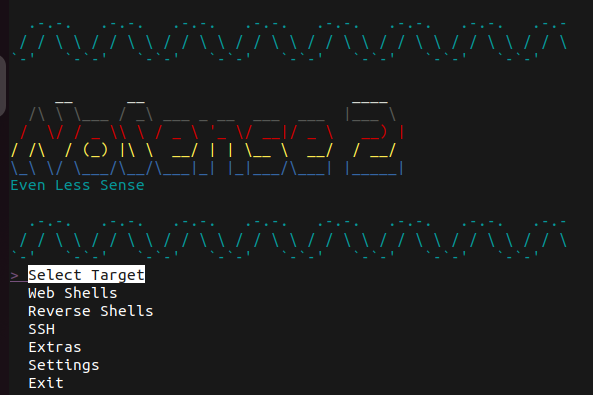

# NoSense
Create multiple backdoors for Pfsense. Attack 1 or more at once!
# Web Shells
- Skidy:
  - Easily found 
  - Takes GET parameter cmd
- Amatuer:
  - Only accessible through host that uploaded it, otherwise an "error" is shown
  - Takes GET parameter c that is based64 encoded
- Pro:
  - Only accessible through host that uploaded it, otherwise the user is redirected
  - Takes POST parameter settings that is base64 encoded

# Reverse Shells
- Skidy:
  - Easily found
  - Takes GET parameters ip and Port
- Amatuer:
  - Only accessible through host that uploaded it, otherwise an "error" is shown
  - Takes GET parameter host that is base64 encoded
- Pro:
  - Only accessible through host that uploaded it, otherwise the user is redirected
  - Takes POST paramater route that is base64 encoded

# SSH
- Toggle SSH
  - Either enables or disables SSH on the firewall depending on its current state. **By default SSH is disabled!**                                                                    
- Add SSH User
  - Attempts to add a user, **This requires a root SSH key**                                                                                    
- Setup User Keys
  - Retrieve SSH keys for a given user, if not root key is present will create and retrieve one.                                          
- Execute CMDs via SSH
  - Execute commands via SSH, keys will be needed.                                                               
- Copy Files to/from Pfsense
  - Copy files to and from the firewall, keys will be needed.

# Extras
- Remove Auth/Web Logs
  - Redirects all logs through a file to **/dev/null** 
- Enable all WAN ports
  - As it says opens all WAN ports.
- Check for Logged in Users
  - Checks for users logged in who have a session, SSH etc. Then able to kick them off.
- Enable Console Password
  - Enables the password on the real/fake console input. This is helpful if the firewall is being accessed via a GUI like VSphere etc.
- Change Admin
  - Change the admin's password, always fun.

# Settings
- Show All Settings
  - Show all the settings for the selected firewall
- Change Name
  - Change the name of the selected firewall.
- Change IP
  - Change the IP of the selected firewall.
- Change URL
  - Change the url of the selected firewall.
- Change Username
  - Change the username of the selected firewall. **Only locally**
- Change Password
  - Change the password of the selected firewall. **Only locally**
- Add Firewall
  - Add a firewall to the database to attack
- Delete Firewall
  - Delete a firewall form the database
- Change Attacker
  - Change the details of the IP your attacking from (this is used in bits, but obfuscated)

# Tips
- Get root keys asap
- Get some shells in place asap
- Add users and get their keys asap
- Constantly check for logged in users
- If ur feeling horrible lock their console, and change the admin password.